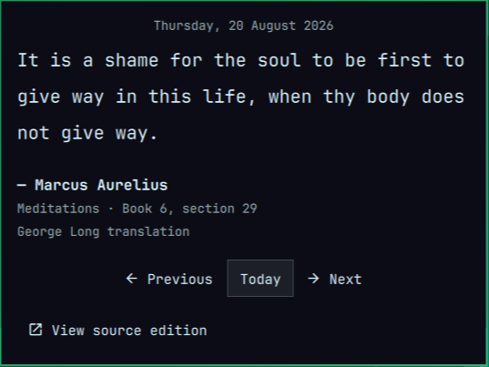

# Stoic Meditations for Omarchy

An offline, text-first Omarchy Quattro plugin that presents one short reading
per day from independent public-domain editions of Marcus Aurelius and
Epictetus.



The reading is deterministic for a given local date. Use
Previous and Next to browse without changing the daily schedule, or Today to
return to the current reading.

## Included works

- Marcus Aurelius, *Meditations*, translated by George Long
- Epictetus, *The Enchiridion*, translated by George Long
- Epictetus, *Discourses*, translated by George Long

The three works are interleaved into one fixed rotation. Every local date maps
to exactly one reading, regardless of restarts or navigation.

The checked-in corpus contains only complete plain-text units of at most 1,200
characters. It never truncates or paraphrases source text. See [SOURCES.md](SOURCES.md)
for exact editions, pinned revisions, selection rules, and rights information.

## Privacy and runtime boundary

The plugin performs no runtime network requests. Its corpus is bundled in
`data/meditations.json`; opening an edition in a browser happens only when you
select **View source edition**.

There are no accounts, analytics, cookies, telemetry, background processes,
audio dependencies, API keys, or install hooks. A one-minute local timer only
keeps the selected calendar date current if the shell remains running across
midnight.

## Requirements

- Omarchy Quattro with third-party shell plugin support
- `xdg-open` for the optional source-edition action

Python is needed only by maintainers rebuilding the corpus, not at runtime.

## Install

Omarchy plugins run as unsandboxed code inside `omarchy-shell`. Review this
repository before installation, then run:

```bash
omarchy plugin add https://github.com/davidojedalopez/omarchy-stoic-meditations.git --enable
```

The plugin ID is `dev.davidojeda.stoic-meditations`.

## Usage

1. Select the book icon in the bar.
2. Read the complete passage and its work, locator, and translator credit.
3. Use **Previous**, **Today**, and **Next** to browse dates.
4. Optionally select **View source edition** to open the matching Standard
   Ebooks edition.

Up and Down (or `J` and `K`) scroll the reading. Left and Right (or `H` and
`L`) move between controls, Enter or Space activates the selected control,
`T` returns to today, and Escape closes the panel.

## Rebuilding the corpus

The generator downloads only the source files listed in `SOURCES.md`, at the
exact commits recorded in the script:

```bash
python3 scripts/build_corpus.py
```

Runtime behavior remains offline because the generated JSON is checked into
the repository. Review the corpus diff whenever a pinned revision changes.

## Development and validation

Run the deterministic checks without network access:

```bash
python3 -m unittest discover -s tests -p 'test_*.py' -v
python3 -m json.tool manifest.json >/dev/null
python3 -m json.tool data/meditations.json >/dev/null
qmllint BarWidget.qml Panel.qml MeditationController.qml tests/qml/tst_MeditationController.qml
```

On an Omarchy Quattro machine, also run:

```bash
omarchy plugin validate .
quickshell -p RuntimeSmoke.qml
```

If a Qt 6 `qmltestrunner` is installed, the focused controller suite can also
be run with `-import /usr/share/omarchy/shell -import "$PWD" -input tests/qml`.

For a release smoke test, install from the final Git revision and verify the
same date remains stable, date navigation, a shell restart, an offline panel open,
the edition action, keyboard focus, and Escape.

## Remove

```bash
omarchy plugin remove dev.davidojeda.stoic-meditations
```

## License

The MIT license covers the plugin source code. The bundled literary texts have
their own public-domain and CC0 provenance described in [SOURCES.md](SOURCES.md).
